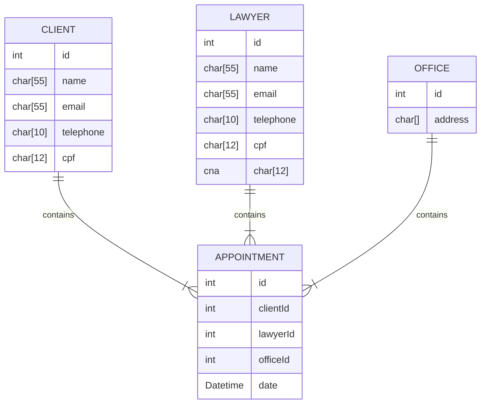

# Sig Law
Projeto da disciplina de Programação UFRN: SIG-Law: Um Sistema de Agendamento para Escritórios de Advocacia.

# Módulos

O sistema contempla os seguintes módulos: clientes, advogados, escritórios e agendamentos.

# Modelo Físico



# Testes

Os testes unitários foram feitos com o Framework <a href="https://github.com/ThrowTheSwitch/Unity">Unity</a>. São executados ao rodar o `makefile`:

```bash
make
```