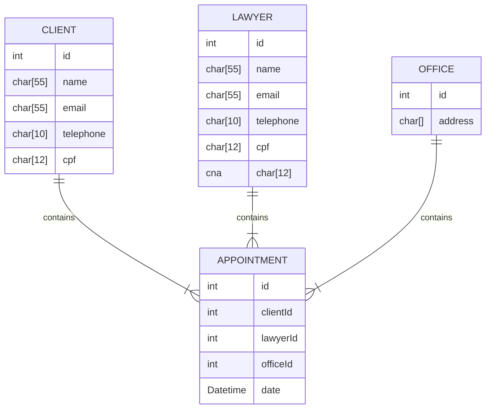

# Sig Law
O projeto desenvolvido é um sistema de agendamento para uma advocacia, criado em linguagem C. Ele tem como principal funcionalidade o agendamento de reuniões entre clientes e advogados, facilitando a organização dos atendimentos. Este trabalho é uma tarefa realizada para a disciplina de Programação do curso de Bacharelado em Sistemas de Informação na UFRN.

# Módulos

O sistema contempla os seguintes módulos: clientes, advogados, escritórios e agendamentos.

# Modelo Físico



# Testes

Os testes unitários foram feitos com o Framework <a href="https://github.com/ThrowTheSwitch/Unity">Unity</a>. São executados ao rodar o `makefile`:

```bash
make
```